# Searching

> [Algorithms - 3 Searching](http://algs4.cs.princeton.edu/30searching/)

## Symbol Table

> [Algorithms - 3.1 Elementary Symbol Tables](http://algs4.cs.princeton.edu/31elementary)

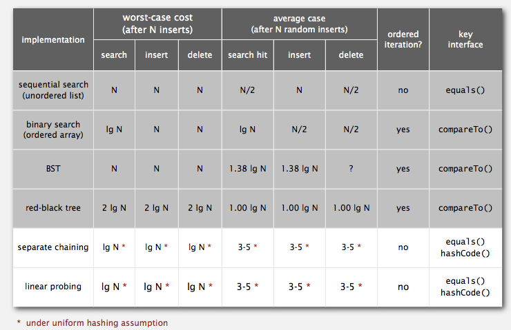

**Description**

Associative array abstraction. Associate one value with each key.

**Conventions**

+ Values are not null.
+ Method get() returns null if key not present.
+ Method put() overwrites old value with new value.

**Basic API**

+ `void put(Key key, Value val)` put key-value pair into the table (remove key from table if value is null)
+ `Value get(Key key)` value paired with key (null if key is absent)
+ `void delete(Key key)`
+ `boolean contains(Key key)`
+ `boolean isEmpty()`
+ `int size()`
+ `Iterable<Key> keys()`

**Category**

+ Keys in order, Ordered Array, Binary Search Tree
+ Keys not in order, Hash Table

**Ordered symbol table**

+ Sequential search in a linked list
+ Binary search in an ordered array 
+ Binary search tree

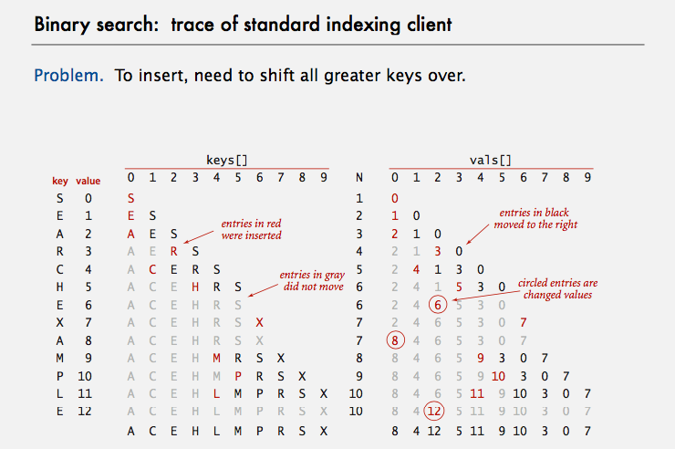

Besides basic APIs, there are:

+ `Key min()`
+ `Key max()`
+ `Key floor(Key key)` largest key less than or equal to key
+ `Key ceiling(Key key)` smallest key greater than or equal to key
+ `int rank(Key key)` number of keys less than key
+ `Key select(int k)` key of rank k
+ `void deleteMin()`
+ `void deleteMax()`

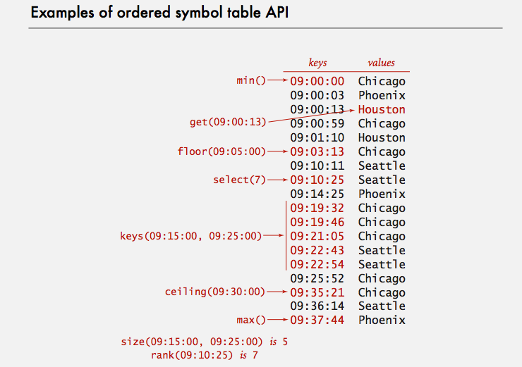

**Application**

+ Set
+ Dictionary Client
+ Index Client
+ Sparse Vector

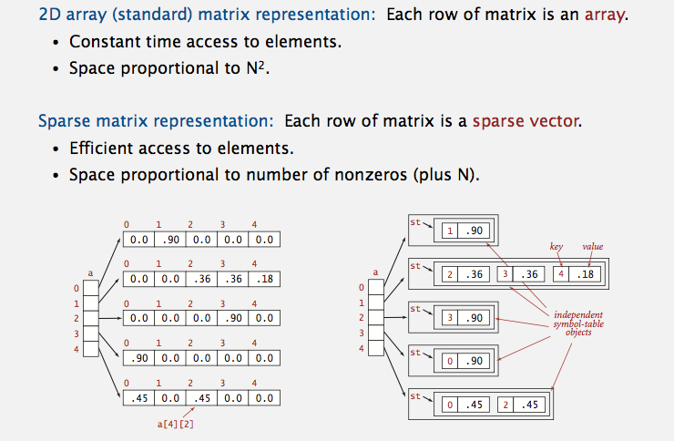

## Binary Search Tree

> + [Algorithms - 3.2 Binary Search Trees](http://algs4.cs.princeton.edu/32bst/)
> + [Algorithms - 3.3 Balanced Search Trees](http://algs4.cs.princeton.edu/33balanced/)

**Definition**

+ Binary Heap - Completed binary tree in symmetric order (each node has a key, which is larger than all keys in its left and right subtree)
+ Binary Tree - Empty or with disjoint left and right binary trees
+ Binary Search Tree - A binary tree in symmetric order (each node has a key, which is larger than all keys in its left subtree, smaller than all keys in its right subtree)
+ Balanced Binary Search Tree - Performance guarantee
  - 2-3 Search Tree
  - Red-black BST
  - B-Tree

**API**

+ `void put(Key key, Value val)`
+ `Value get(Key key)`
+ `boolean contains(Key key)`
+ `int size()`
+ `boolean isEmpty()`
+ `Key min()`
+ `Key max()`
+ `Key floor(Key key)` largest key less than or equal to key
+ `Key ceiling(Key key)` smallest key greater than or equal to key
+ `int rank(Key key)` number of keys less than key
+ `Key select(int k)` key of rank k
+ `void delete(Key key)`
+ `void deleteMin()`
+ `void deleteMax()`
+ `Iterable<Key> iterator()`

## 2-3 Search Tree

Allow 1 or 2 keys per node.

+ 2-node: one key, two children
+ 3-node: two keys, three children

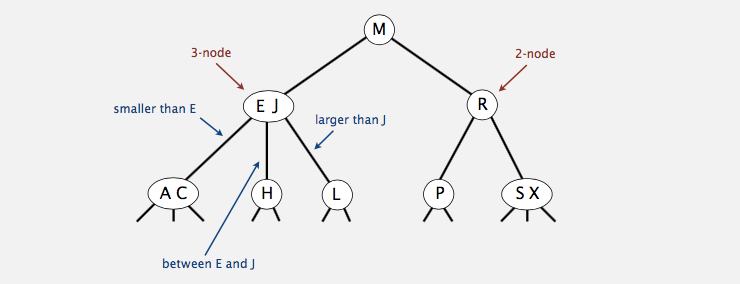

**Invariants**

Maintains symmetric order and perfect balance.

+ Symmetric order. Inorder traversal yields keys in ascending order.
+ Perfect balance. Every path from root to null link has same length.

**Insertion**

+ Travere finding the right place.
+ Insertion into a 2-node, make it a 3-node.
+ Insertion into a 3-node at bottom.
  - Add new key to 3-node to create temporary 4-node.
  - Move middle key in 4-node into parent.
  - Repeat up the tree, as necessary.
  - If you reach the root and it's a 4-node, split it into three 2-nodes.

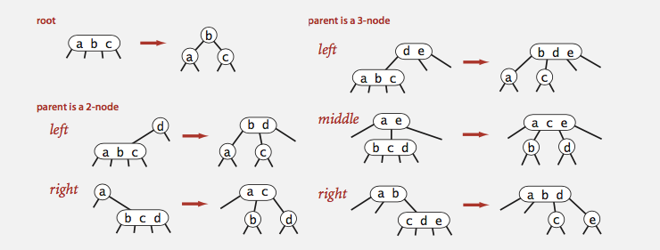

**Performance**

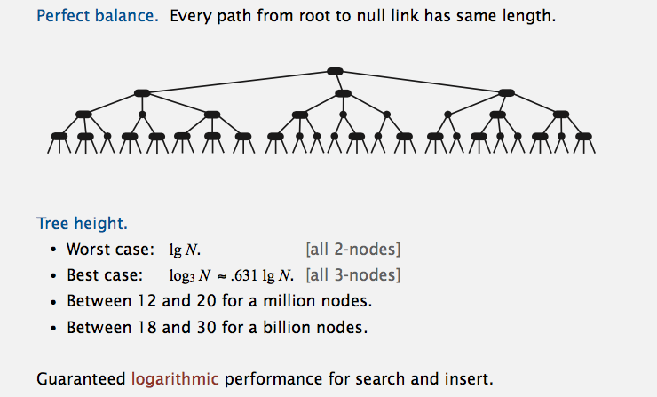

## Left-Leaning Red-Black BST

> Guibas-Sedgewick 1979 and Sedgewick 2007

+ Represent 2–3 tree as a BST.
+ Use "internal" left-leaning links as "glue" for 3–nodes.

**Invariants**

+ No node has two red links connected to it.
+ Every path from root to null link has the same number of black links. (perfect black balance)
+ Red links lean left.

**1–1 correspondence between 2–3 and LL**

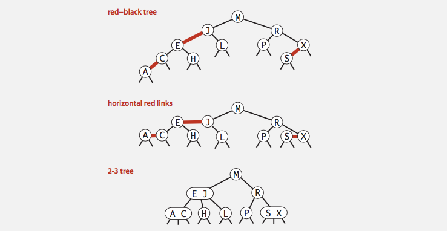

**Elementary Operations**

+ `rotate_left(node)`
+ `rotate_right(node)`
+ `flip_colors(node)`

**Insertion**

Several insertion situations, like insert into a 2-node, 3-node. Below is a really complicated one.

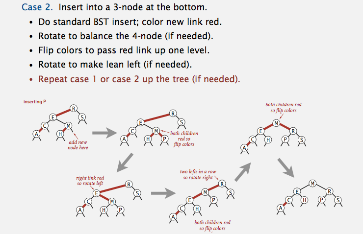

**What's most amazing?!**

We can have the same code for all cases.

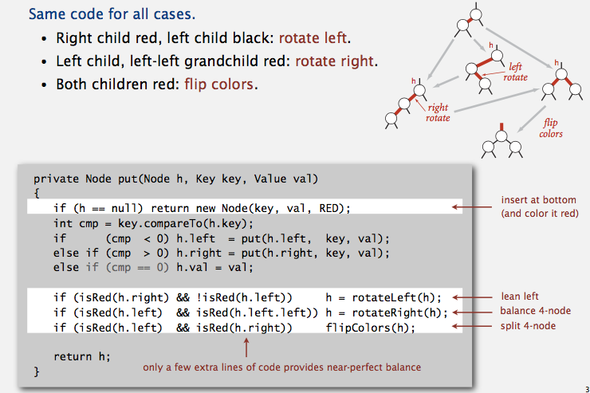

**Performance**

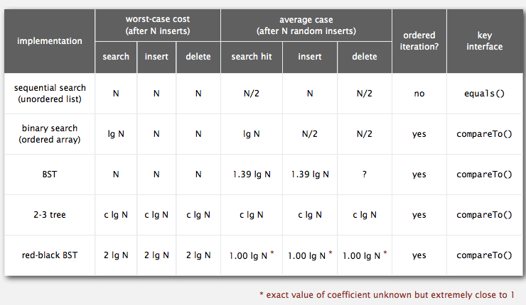

## B-Tree

Generalize 2-3 trees by allowing up to M - 1 key-link pairs per node.

+ At least 2 key-link pairs at root.
+ At least M / 2 key-link pairs in other nodes.
+ External nodes contain client keys.
+ Internal nodes contain copies of keys to guide search.

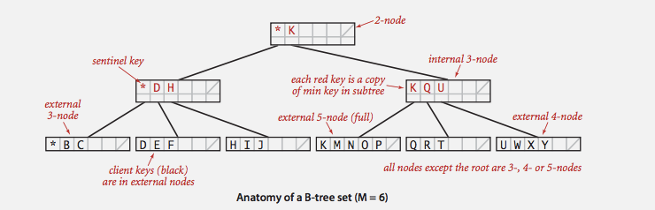

**Search**

+ Start at root.
+ Find interval for search key and take corresponding link.
+ Search terminates in external node.

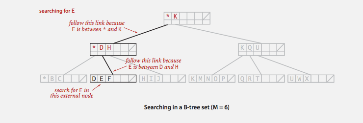

**Insertion**

+ Search for new key.
+ Insert at bottom.
+ Split nodes with M key-link pairs on the way up the tree.

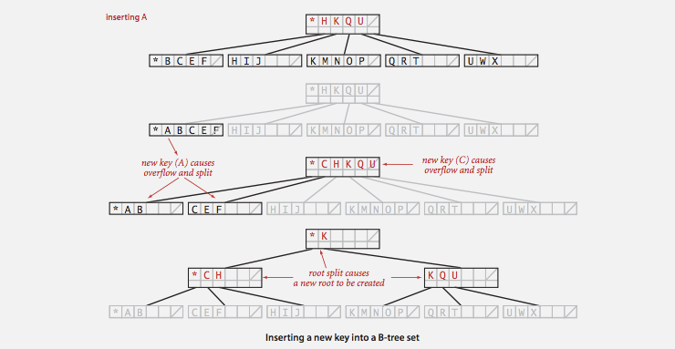

**Performance**

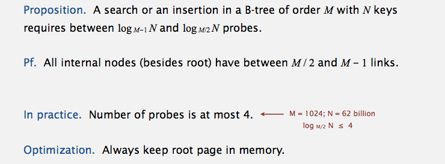

## Hash Table

> [Algorithms - 3.4 Hash Tables](http://algs4.cs.princeton.edu/34hash/)

Save items in a key-indexed table (Array like). Hash function is the method for computing array index from key.

**Hash Function**

Horner's method, 31x + y rule.

```ruby
def hash_code_of(str)
  hash = 0
  str.chars.each do |char|
    hash = char.ord + 31*hash
  end

  return hash
end
```

**Uniform Hashing Assumption**

Each key is equally likely to hash to an integer between 0 and M - 1.

**Collision Resolution**

+ Seperate Chaining
  - Easier to implement delete.
  - Performance degrades gracefully.
  - Clustering less sensitive to poorly-designed hash function.
+ Linear Probing (Open addressing)
  - Less wasted space.
  - Better cache performance.

**Seperate Chaining**

Use an array of M < N linked lists.

+ Hash: map key to integer i between 0 and M - 1.
+ Insert: put at front of ith chain (if not already there).
+ Search: need to search only ith chain.

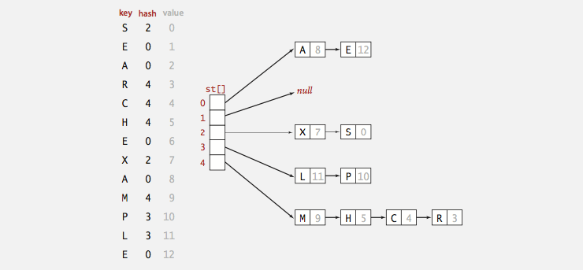

*Performance*

Number of probes for search/insert is proportional to N / M.

+ M too large -> too many empty chains.
+ M too small -> chains too long.
+ Typical choice: M ~ N / 5 -> constant-time ops.

**Linear Probing (Open Addressing)**

Array size M must be greater than number of key-value pairs N.

+ Hash: Map key to integer i between 0 and M-1.
+ Insert: Put at table index i if free; if not try i+1, i+2, etc.
+ Search: Search table index i; if occupied but no match, try i+1, i+2, etc.


*Performance*

It's likely to form a cluster, which is a contiguous block of items. And new keys likely to hash into middle of big clusters.

Knuth has a Parking Problem. Cars arrive at one-way street with M parking spaces. Each desires a random space i : if space i is taken, try i + 1, i + 2, etc.

+ Half-full. With M / 2 cars, mean displacement is ~ 3 / 2.
+ Full. With M cars, mean displacement is ~ sqrt(π M  8).

Conclusion

+ M too large -> too many empty array entries.
+ M too small -> search time blows up.
+ Typical choice: α = N / M ~ 1⁄2. # probes for search hit is about 32, probes for search miss is about 5/2


**Hashing Variants**

Two-probe hashing. (separate-chaining variant)

+ Hash to two positions, insert key in shorter of the two chains.
+ Reduces expected length of the longest chain to log log N.

Double hashing. (linear-probing variant)

+ Use linear probing, but skip a variable amount, not just 1 each time.
+ Effectively eliminates clustering.
+ Can allow table to become nearly full.
+ More difficult to implement delete.

Cuckoo hashing. (linear-probing variant)

+ Hash key to two positions; insert key into either position; if occupied, reinsert displaced key into its alternative position (and recur).
+ Constant worst case time for search.
