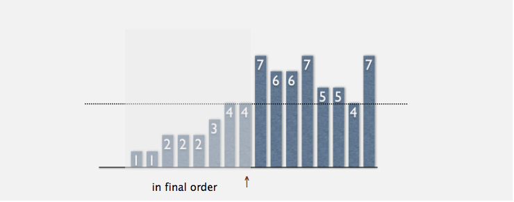
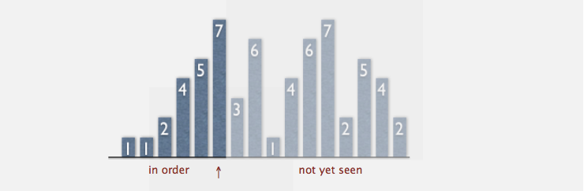
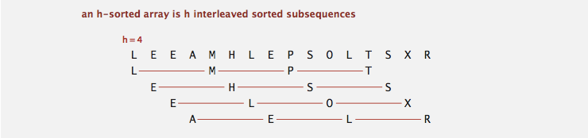
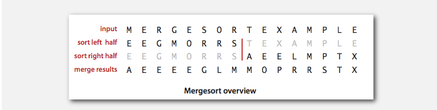
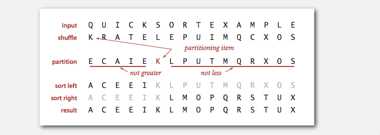
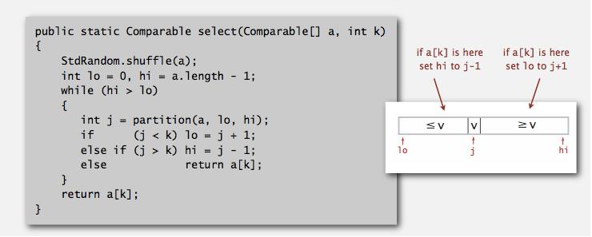
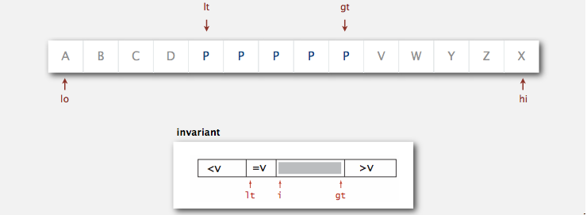
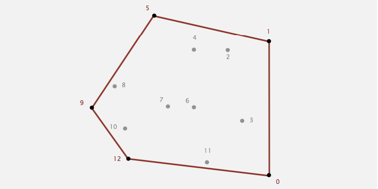
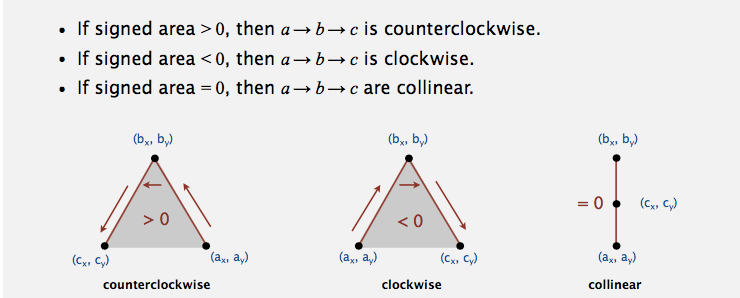

# Sorting

> [Algorithms - 2 Sorting](http://algs4.cs.princeton.edu/20sorting/)

name        | inplace?  | stable? | worst   | average | best    | remarks
-------     | --------  | ------- | -----   | ------- | ----    | -------
selection   | ✔         |         | N^2/2   | N^2/2   | N^2/2   | N exchanges
insertion   | ✔         | ✔       | N^2/2   | N^2/4   | N       | use for small N or partially ordered
shell       | ✔         |         | ?       | ?       | N       | tight code, subquadratic
merge       |           | ✔       | NlgN    | NlgN    | NlgN    | NlgN guarantee, stable
quick       | ✔         |         | N^2/2   | 2NlnN   | NlgN    | NlgN probabilistic guarantee, fastest in practice
3-way quick | ✔         |         | N^2/2   | 2NlnN   | N       | improves quicksort in presence of duplicate keys
???         | ✔         | ✔       | NlgN    | NlgN    | N       | holy sorting grail

## Elementary Sorts

> [Algorithms - 2.1 Elementary Sorts](http://algs4.cs.princeton.edu/21elementary/)

**Rules of the game**

+ Basic API:
  - `less(v, w)`
  - `swap(ar, i, j)`

+ Sorting cost model: compares and exchanges.
+ Extra memory: in-place and extra-place

#### Selection Sort

Algorithm: Scans from left to right

Invariants:

+ Entries the left of i (include i) fixed and in ascending order.
+ No entry to right of i is smaller than any entry to the left of i.

#### Insertion Sort

Algorithm: Scans from left to right

Invariants:

+ Entries to the left of i (include i) fixed and in ascending order.
+ Entries to the right of i have not yet been seen.

**Inversion**

Def. An inversion is a pair of keys that are out of order.

+ Def. An array is **partially sorted** if the number of inversions is <= cN.
+ Proposition. For partially-sorted arrays, insertion sort runs in linear time.
+ Pf. Number of exchanges equals the number of inversions.

#### Shell Sort

> idea: reduce the inversions

+ Move entries more than one poisition at a time by **h-sorting** the array.
+ Knuth's incremental sequence is `3x+1`.
+ Example of simple idea leading to substantial performace gains.

#### Knuth Shuffle

Algorithm:

+ In iteration i, pick integer r between 0 and i uniformly at random.
+ Swap a[i] and a[r]

## Mergesort

> [Algorithms - 2.2 Mergesort](http://algs4.cs.princeton.edu/22mergesort)

Algorithm

+ Divide array into two halves.
+ Recursively sort each half.
+ Merge two halves.

Improvements

+ Cutoff to insertion sort for ~ 7 items. (Has too much overhead for tiny subarrays)
+ Stop if already sorted, is biggest in first half <= smallest in second half.

Bottom-up mergesort

+ Pass through array, merging subarrays of size 1.
+ Repeat for subarrays of size 2, 4, 8, 16, ...

## Quicksort

> [Algorithms - 2.3 Quicksort](http://algs4.cs.princeton.edu/23quicksort)

Algorithm

+ Shuffle the array. (performace guarantee)
+ Partition so that, for some j
  - entry a[j] is in place
  - no larger entry to the left of j
  - no smaller entry to the right of j
+ Sort each piece recursively

Improvements

+ Cutoff to insertion sort for ~ 10 items. (Has too much overhead for tiny subarrays)
+ Median of sample `median_of_3(arr, lo, (lo+hi)/2, hi)`

**Quick Select**

> Top k, find a k-th smalles item.

Algorithm

+ Partition array so that entry a[j] is in place.
+ Repeat in one subarray, depending on comparison with j.
+ Finish when j equals k.

**Duplicate Keys**

> Entropy-optimal sorting && Dutch national flag problem

Algorithm: Dijkstra 3-way partition

+ Let v be partition item a[lo].
+ Scan i from left to right.
  - (a[i]  < v): exchange a[lt] with a[i]; increment both lt and i
  - (a[i]  > v): exchange a[gt] with a[i]; decrement gt
  - (a[i] == v): increment i

## Priority Queues

> [Algorithms - 2.4 Priority Queues](http://algs4.cs.princeton.edu/24pq)

API

+ `initialize(arr)` create a priority queue with given keys
+ `insert(v)`
+ `delete_max()` return and remove the max/min key

**Binary Heap**

+ Binary tree - Empty or node with links to left and right binary trees.
+ Compelte binary tree - Perfectly balanced, except for bottom level. (Property. Height of complete tree with N nodes is lg N)
+ Binary heap - Array representation of a heap-ordered complete binary tree.

Property

+ Largest key is a[1], which is root of binary tree.
+ Can use array indices to move through tree. (Indices start at 1)
  - Parent of node at k is at k/2.
  - Children of node at k are at 2k and 2k+1.

API

+ `swim(k)`, promotion. Child's key becomes larger key than its parent's key.
+ `sink(k)`, demotion. Parent's key becomes smaller than one (or both) of its children's.
+ `insert(v)`. Add node at end, and swim it up.
+ `delete_max()` . Exchange root with node at end, sink it down.

Consideration

+ Immutability of keys. Better use immutable keys.
+ Underflow and overflow. Throw exception if deleting from empty PQ.
+ Minimum-oriented priority queue. Replace `less()` with `greater()`
+ Other operations.
  - Remove an arbitrary item.
  - Change the priority of an item.

## Application

#### System sorts

Mergesort

+ Java sort for objects.
+ Perl, C++ stable sort, Python stable sort, Firefox JavaScript, ...

Quicksortu
+ Java sort for primitive types.
+ C qsort, Unix, Visual C++, Python, Matlab, Chrome JavaScript, ...

Q. Why use different algorithms for primitive and reference types?

+ Merge sort for objects, because it's stable, and maybe who using objects has less consideration about spaces.
+ Quick sort for primitves. Faster in practice and also save space.

#### Convex Hull

Algorithm: Graham Scan

+ Choose point p with smallest y-coordinate.
+ Sort points by polar angle with p.
+ Consider points in order; discard unless it create a ccw turn.

Q. How to check a CCW turn

