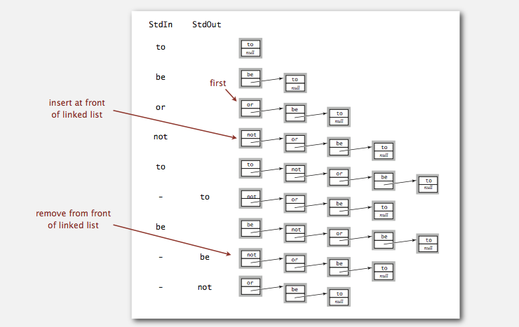
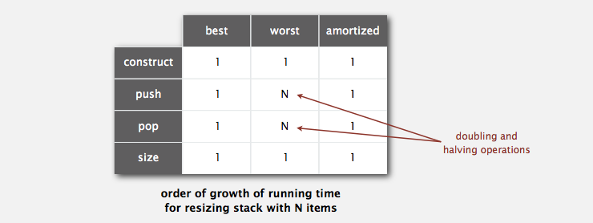

# Stacks and Queues

> [Algorithms - 1.3 Bags, Queues, and Stacks](http://algs4.cs.princeton.edu/13stacks/)

## Stack

**API**

+ `push(item)`
+ `pop()`
+ `is_empty?()`
+ `size()`

**Linked List**

**Resizing Array**

*Invariant*

Array is between 25% and 100% full.

+ `push()`: double size of array s[] when array is full.
+ `pop()`: halve size of array s[] when array is one-quarter full.

*Performance*

**Linked List vs. Resizing Array**

*Linked List*

+ Every operation takes constant time in the worst case.
+ Uses extra time and space to deal with the links.

*Resizing Array*

+ Every operation takes constant amortized time.
+ Less wasted space.

